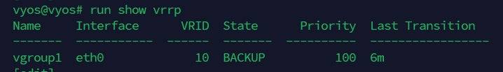
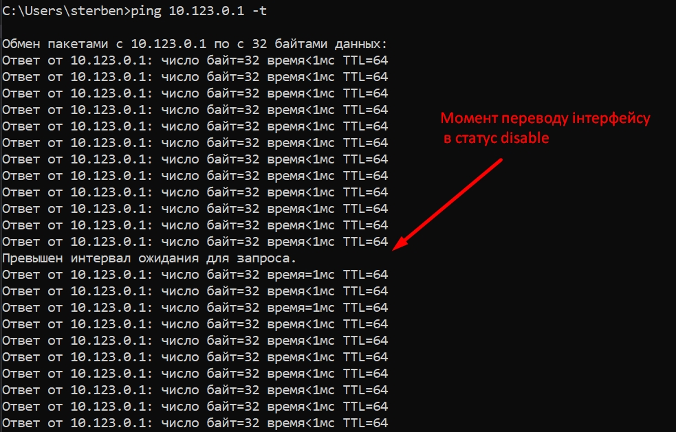

# Перший хост 
```bash
sudo su 
install image 
```

## Конфігурація vrrp

```bash
configure
set interfaces ethernet eth0 address dhcp
set service ssh # optional (для того щоб можна було підключитися по ssh)
set high-availability vrrp group vgroup1 vrid 10
set high-availability vrrp group vgroup1 interface eth0
set high-availability vrrp group vgroup1 address 10.123.0.1/24
set high-availability vrrp group vgroup1 priority 110
set high-availability vrrp group vgroup1 preempt-delay 20
commit
save
```

# Другий хост 

```bash
sudo su 
install image 
```
## Конфігурація vrrp

```bash
configure
set interfaces ethernet eth0 address dhcp
set service ssh # optional (для того щоб можна було підключитися по ssh)
set high-availability vrrp group vgroup1 vrid 10
set high-availability vrrp group vgroup1 interface eth0
set high-availability vrrp group vgroup1 address 10.123.0.1/24
set high-availability vrrp group vgroup1 priority 100
set high-availability vrrp group vgroup1 preempt-delay 20
commit
save
```
## Перевірка 
```bash
run show vrrp
```




Переведемо інтерфейс на master в disable 
```bash 
set interfaces ethernet eth0 disable
```


Виконаємо ще раз команду для того щоб побачити чи змінився `State` на наших хостах
```bash
run show vrrp
```
